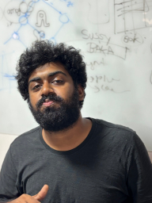
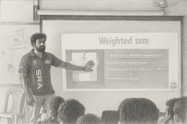

 
# Yo!
 I'm **Shri Vishakh Devanand**, a sophomore engineering student from India absolutely obsessed with mathematics, physics and electronics. I thrive at the intersection of hardware and software, applying complex mathematical concepts to solve real engineering challenges.

## What I Do
- Built a fully functional RISC-V CPU on FPGA from scratch
- Dive deep into complex analysis, abstract algebra, and discrete mathematics
- Developing custom zig based compiler for ESP32.
- Create bio-inspired robots that mimic animal behavior.

## My Vision
Mathematics is my universal language for innovation - whether optimizing algorithms, designing circuits, or modeling control systems. I'm constantly exploring the beautiful intersection where theoretical math meets practical engineering.

## Fun Facts
- Maintain a personal notebook of elegant mathematical proofs (collecting all of them into a single one is remaining 😅)
- Can lose myself for hours in puzzles
- Love to challenge myself

Do check out my Github and LinkedIn profiles to know more about my projects and interests.
Feel free to reach out to me for collaborations or discussions on any of the topics you are passionate about.
I'm always up for a good chat!

Also check out my blogs on the navigation bar! 😄
