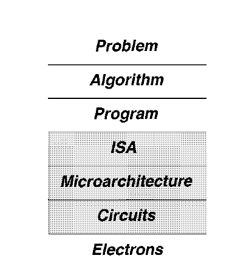

--- 
title: Agents for Microprocessor Evolution 
parent: Computer Architecture
permalink: notes/comp_arch/agents_for_micro_eval
layout: content
--- 

# Requirements, Bottlenecks, and Good Fortune: Agents for Microprocessor Evolution
```
by yale patt
```

## Basic Framework

 - Computer Architecture: A science of tradeoffs
    - Comp arch is more "art" than "science"
    - Almost always the job of the comp architect requires using that fundamental knowledge to make tradeoffs.
 - Levels of Transformation
    - There are levels of transformations that is being done whenever there's a high level program that is being done.
    - Like take for example a C code, it first compiles into an assembly code (a lot more process that happens but not imp here).
    - This "assembly" code is basically converted into where ISA structure is used, where ISA defines on how the assembly code is being defined.
    - Now, Even though the "assembly" code is now converted into something in binary, how this binary is being processed is (which bits need to go where in order for the "assembly" line to be processed actually) [Instruction is being processed]
    - This is called microarchitecture.
    - This microarchitecture is defined by actual electronic circuit design, and in the end electrons.
    - These are the levels of transformation that occurs from any problem to actually making it solve by a circuit (or by electrons).




  - Design Points
    - When working in the microarchitecture part, there is always a purpose towards what you are trying to achieve.
    - This is called the Design Point.
    - It could be something like, making a core more power efficient , fault tolerant (server chips), highest power etc.
  - Application Space
    - Sometimes the chips that we design are application specific, and sometimes generalistic in nature, this is what we call application space here.
  - The Basics of Processing
    - Simply put, a microprocessor processes instructions.
    - To do this, it has to do three things:
      - Supply instructions to the core of the processor where the instructions are executed.
      - Supply data required for the instructions
      - Perform the operation required by each instruction.
  - Instruction Supply
    - fetching one instruction at a time is slow when processors are getting faster and better at processing them.
    - So, the fetching of instructions should be done in parallel, making it more efficient.
  - Data Supply
    - Once the instruction is fetched, the data required for the instruction is supplied to the processor.
    - This must be done in a fast manner as well.
    - So faster caches (on-chip RAM) are used to supply the data for a particular instruction.
  - Instruction Processing
    - Once the instruction is fetched and the data is supplied, the instruction must also be processed fast.
    - To perform the operations required by these instructions, the processor needs a sufficient number of functional units to process the data.

## Agents for Evolution
  - The creativity of engineers to come up with answers where there were problems--- without solutions, there would be no Evolution.

  - Agent I: New Requirements
    - The demand for higher performance dictated that fetching one instruction at a time was not enough.
    - Examples like this forces evolution and creative solution thinking.
  - Agent II: Bottlenecks
    - We have 3 components of instruction processing (instruction supply, data supply, and carrying out the operations of the instruction).
    - By far, most of the improvements to the microprocessor have come about due to attempts to eliminate bottlenecks that prevent these components from being fully utilized.
  - Agent III: Good Fortune
    - Good Fortune happens when something causes a windfall which can then be used to provide additional features to the microprocessor.

# References
- [Requirements, Bottlenecks, and Good Fortune: Agents for Microprocessor Evolution](https://course.ece.cmu.edu/~ece740/f13/lib/exe/fetch.php?media=r0_patt.pdf)
