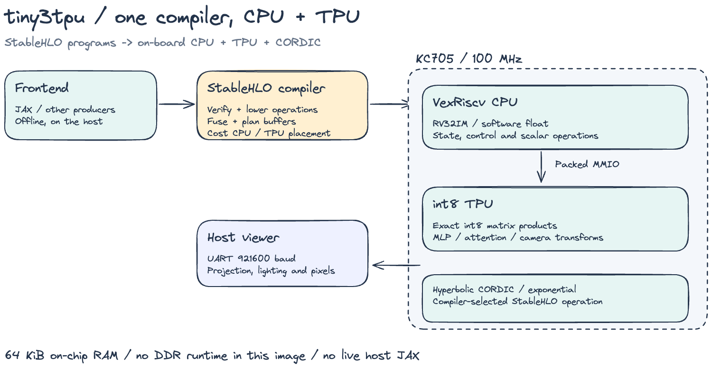
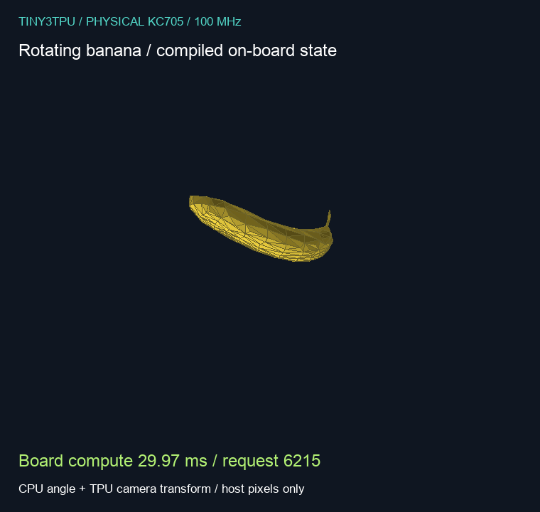
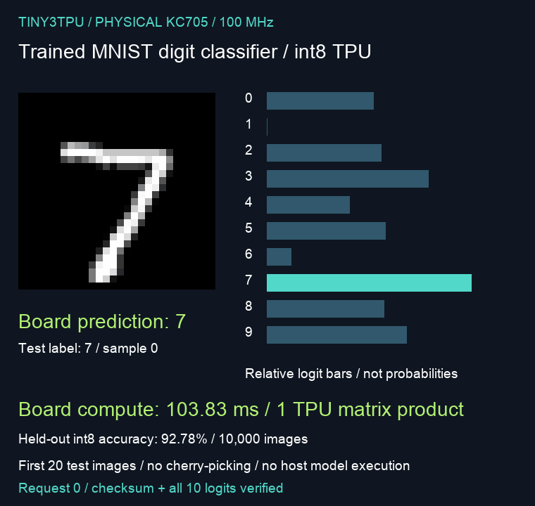

The first version of my tiny TPU multiplied matrices. That was the exciting bit. Numbers went into a little grid of processing elements, and the FPGA handed numbers back.

A matrix multiply is not a program. The program is the rest of it: the loop, the softmax, the integrator, whatever you meant to do with the vector afterward. I wanted that on the same board, compiled from the function, not rewritten by hand every time the demo changed. The array did not get bigger. It is still two 4×4 int8 cores. The work went into the machine around them, until I could follow one program from my laptop, through the compiler, onto the board, and back.

This is what happened when I did.

## The board got smaller

The [previous post](/blog/tiny-tpu-is-now-bigger) was a Zynq. ARM cores, DDR3, a cached model, UDP. Good board for getting a drawing demo onto a screen. Bad board for what I was trying to do next. I could not retarget that CPU, and I could not really ask whether a program fit. The DRAM was large, and the firmware could always hide more bytes.

So this image is a smaller computer, on purpose. A KC705. A VexRiscv, RV32IM, at 100 MHz. The same two 4×4 cores, accumulating into int32. 64 KiB of on-chip RAM. UART at 921600 baud. Yosys and nextpnr, not Vivado. The routed build met timing at 100 MHz. The tools thought it would go to 111.36.

The chip has DDR on it. I never brought it up, because no open-source controller can talk to it.

## A function goes in

JAX runs on my machine and exports StableHLO. The backend turns that into C for this chip. Loops stay on the CPU. An int8 matrix product goes to the arrays. An exponential goes to a small CORDIC, and only if the bitstream was built with one. The board runs the C. JAX stays on the laptop. `jax.jit` does not know the FPGA exists.

I did not let the compiler paper over the hardware. It will not quantize a float program just so the arrays have work. A float product stays on the CPU. An operation outside the subset does not compile. If the arrays or the CORDIC were supposed to run and cannot, the program stops and returns nothing, instead of quietly finishing in software. Sine, cosine, square root, and division are software. There is no floating-point unit. I understood that as a line in a spec. The cloth is what it actually means.

## The mesh moved

The first program that felt like a program was a mesh. The CPU keeps an angle. The arrays transform 204 vertices into camera coordinates. The laptop only draws. One call to the arrays, 29.57 ms, 613 words back, angle included.

The mesh is cut down from the banana example in [jaxsim](https://github.com/SRA-VJTI/jaxsim/blob/c0a097bba1c6db10cac7b359fbac11cfedc48c6b/examples/softras_simple_render.py). The frames are the coordinates the board returned.

It moved, and I could point at the function that moved it. That was the whole win. I had not yet divided the time by the amount of math.

## Then I divided

The classifier was the obvious second program, and it is not the one from the Zynq post. That model was a small network living in DDR. This one is a single layer, 784 inputs, 10 logits, trained for 10 epochs on 60,000 MNIST images and then quantized: symmetric int8 weights, nonnegative int8 pixels, int32 accumulation. Offline, on the 10,000-image test set, the int8 model gets 92.78%. Float32 gets 92.85%. I did not run those 10,000 images through the FPGA.

On the board it is one array call and about 10.4 million cycles. 104 ms. That is faster than the [Zynq post](/blog/tiny-tpu-is-now-bigger). The best number there was 221 ms, one cached 2-layer draw over UDP. The twenty-sample UDP average was 341 ms end to end, and UART was around 500 ms. The product itself is 7,840 multiply-adds, so the board spent about 1,300 cycles per useful one.

The arrays cannot account for that. If both of them produced 16 results every cycle, the arithmetic would be 245 cycles, 2.5 µs. If the whole chip managed only one multiply-add per cycle, it would still be 7,840 cycles. I timed ten million. Some of those cycles are the CPU. Some are the arrays and the CPU waiting on each other. I don't have a trace that separates them, and I'm not going to invent one. "The TPU classified the digit" is true about the answer. It is the wrong sentence about the time.

The answer, though, is the board's. First 20 test images, in order. Every logit matched native code from the same compiler. It misses one, a 5 it calls a 6. That frame stays in.

## I built the wrong accelerator

Attention is what made me add hardware. Eight tokens, eight features, causal, synthetic weights. Not a language model. Six of the matrix products are int8, so they go to the arrays. Softmax needs an exponential, and the software version on this CPU was slow enough that I could feel it in the whole block.

I built a hyperbolic CORDIC for that one operation. No multipliers. Binary32 in, binary32 out. It subtracts ln(2) in Q3.29, runs iterations 1 through 30, repeating 4 and 13, and rounds ties to even. Then I taught the compiler to lower `stablehlo.exponential` onto it. If the peripheral is not in the image, there is no secret software path. The run fails. On the RTL, 40,014 vectors stayed within 2 ULPs and finished in 187 cycles. Under 2 µs. The unit is fine.

The block was the test. Software exponential took 52.57 ms. The CORDIC took 45.92 ms. Both times, all 64 outputs matched.

I had been calling exponential the bottleneck. The difference is 6.65 ms. That is 12.6% of the run, a 1.145× speedup, which is the same fact said in the way that sounds larger. Forty-six milliseconds were still there, in the other floating-point work and in six trips out to the arrays. I had added an instruction, pointed the compiler at it, and run the same program again. The result was that I had fixed a slice. Most of the time had been somewhere else the whole time.

## The timestep is 130 microseconds

Cloth is where the missing FPU stops being a footnote.

The compiler emits the physics step. VexRiscv runs it in float32. The arrays transform the mesh afterward, and that part barely shows up. A frame in the capture is 32 steps. Physics took between 4.73 and 4.78 seconds. The transform took 5.3 ms. The serial port and the drawing sit with the transform, not with the physics.

The timestep is 1/7680 of a second, about 130 µs. One step costs just under 150 ms. The simulation moves about 1,140 times slower than its own clock. I play the frames back at 100 ms, with the measured cost on the image. Take the caption off and the GIF looks like real-time cloth. It is not.

A single step, started from a state I supplied, matches the native code the compiler emitted. I checked the state and the camera coordinates. Staying on the JAX trajectory for a long time is a different question, and the answer is no.

I ran that trajectory on the host, against JAX. The array there is a software stand-in, so this is about the arithmetic, not about the UART.

| How the step was evaluated | Max position error at 1 s | At 1.5 s |
|---|---:|---:|
| CPU, host libm, transform left in float | 17.3 µm | 8.10 cm |
| CPU, freestanding math, transform left in float | 25.9 µm | 12.22 cm |
| CPU, plus the int8 transform | 25.7 µm | 14.47 cm |

At one second, making the transform int8 is not what hurts. At a second and a half, every version is centimeters away from JAX, including the one that uses the host's own libm and never quantizes anything. The integrator is sensitive. A step can match, and the cloth can still end up somewhere else.

The way out looked obvious. Put the float on a core that has an FPU. I started a Rocket RV64GC backend for that. It never booted on this board, and I stopped. Every capture above is still the VexRiscv, doing the float the slow way.

## Fifty times the memory, before it starts

Then I aimed the same question at a real model. TinyStories-1M. Not to generate text. To see if it could exist here.

The pinned config is a small GPT-Neo. Vocabulary 50,257, hidden size 64, eight layers. I didn't need the checkpoint. The token embeddings in int8 are 50,257 × 64 = 3,216,448 bytes, and the board has 65,536. One table is 49.1× the entire RAM. Int4 cuts it in half and it still doesn't fit. A float32 KV cache for 128 tokens is 8 × 2 × 128 × 64 × 4 = 512 KB, eight times the RAM again, for a tensor I would also need. The logits alone, in float32, are 201 KB.

Nothing was compiled. There is no token rate later in the repo. The CORDIC has nothing to say about it. The DDR on the board would, and nothing open source can bring it up.

What changed, from the week I only had a grid of processing elements, is that a program can now get all the way to a specific wall. The classifier's wall is the cost of reaching the arrays, not the multiply. Attention's wall was mostly not the exponential, which I only know because I built the exponential and the time barely moved. The cloth's wall is software float on a 100 MHz integer core, and past that a trajectory that walks away from JAX even when the float is done carefully. The language model never gets a wall that interesting. It dies in the first multiply.

The code and the captures are in [tiny3tpu](https://github.com/5iri/tiny3tpu).
