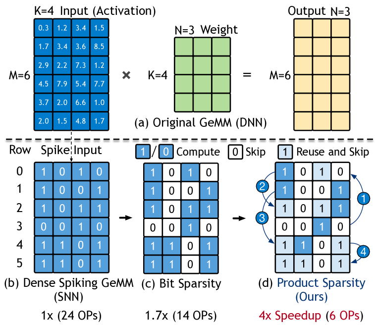
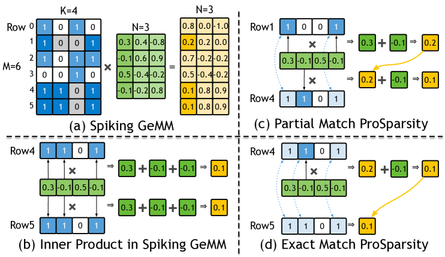
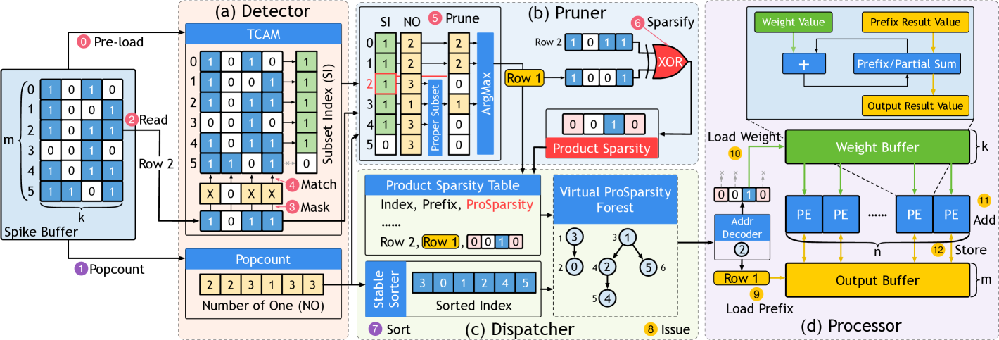
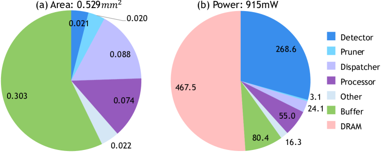

## Prosperity: Accelerating SNNs via Product Sparsity

This study introduces a novel sparsity paradigm called **product sparsity**, which re-uses identical or nested spike patterns during matrix multiplication to eliminate redundant work and dramatically speed up spiking-neural-network (SNN) inference.

---

## What is Product Sparsity?



Consider the six 4-bit rows sketched above.  
A naïve engine would perform  
$$6 \times 4 = 24$$  
multiply–accumulate (MAC) operations.  
Product sparsity recognises that several rows share the same 1-bit *prefix*.  
By computing each prefix once and re-using it, the count collapses to only 6 MACs—a **4 × speed-up**—while producing the exact same outputs.

### Core Concept and Hardware Implementation
- **Combinatorial Similarity Exploitation**: Identifies shared binary patterns across spike matrix rows. For example, if Row 1 (1001) and Row 4 (1101) share “1001,” the inner product of the shared prefix is computed once and reused, reducing operations by 75% in the toy example.
- **Hardware Efficiency**: Converts an $$O(m^n)$$ combinatorial problem into linear complexity $$O(m)$$ by restricting comparisons to two-row relationships (EM, PM, Int) and using a lightweight forest data structure.
- **TCAM-Based Detection**: A 1 KB ternary content-addressable memory (TCAM) scans spike rows in parallel to identify prefix matches in one cycle.  

---

In SNNs, each layer emits multiple **binary spike matrices** (one per time step).  
If we stack those matrices vertically we obtain one large binary **spike matrix** $$\mathbf M$$.  
Spiking inference therefore boils down to a single large matrix multiplication:

$$
\underbrace{\mathbf M_{M \times K}}_{\text{spikes}}
\;\times\;
\underbrace{\mathbf W_{K \times N}}_{\text{weights}}
\;=\;
\underbrace{\mathbf O_{M \times N}}_{\text{outputs}}
$$

The paper names this operation **Spiking GeMM**.

---

## Product Sparsity in Spiking GeMM

*Idea.* Exploit **row-to-row overlap** in $$\mathbf M$$.

1. **Bit-sparsity** (classical):  
   skip every 0-bit in a row.  
2. **Product-sparsity** (new):  
   if two rows share a non-empty subset of 1-bits, compute that shared prefix **once** and reuse the result.



---

## Spatial Relationship of Product Sparsity

Define each spike row as the **set of active column indices**:

$$
S_i = \{\,j \mid \mathbf M[i,j] = 1 \,\}.
$$

Searching for reusable prefixes means inspecting **set relationships** among the $$n$$ rows.  
To keep hardware tractable, Prosperity restricts itself to **two-row comparisons** $$n = 2$$, which scales as $$O(m^2)$$ instead of $$O(m^n)$$ for larger $$n$$.

### Three Kinds of Product-Sparsity Relationships

| Name                   | Condition                                                                    | Intuition                                      | Re-use                                           |
|------------------------|-------------------------------------------------------------------------------|------------------------------------------------|--------------------------------------------------|
| **Exact Match (EM)**   | $$S_i = S_j$$                                                                | Rows are identical                             | Copy the earlier result; 0 MACs                  |
| **Prefix Match (PM)**  | $$S_i \subset S_j$$                                                          | One row is a strict subset of the other        | Reuse prefix; compute only the suffix bits       |
| **Intersection (Int)** | $$S_i \cap S_j \neq \varnothing,\;S_i\not\subset S_j,\;S_j\not\subset S_i$$ | Partial overlap                                 | *Not implemented* (too costly)                   |

### Temporal Ordering – Prefix vs Suffix

Reuse is valid only if the **prefix row is processed first**.  
Prosperity enforces a simple partial order:

* If rows are **EM** → lower row-ID is prefix.  
* If rows are **PM** → the subset row is prefix.

### Spatial vs. Temporal Optimization
- **Spatial**: Limits dependencies to one prefix per row (forest structure).
- **Temporal**: Enforces execution order (lower-ID rows first) via dispatcher to maximize reuse.

---

## ProSparsity Forest

A naive dependency graph needs $$O(m^2)$$ edges.  
Prosperity **prunes** it:

* keep at most **one** prefix per row (the "best-overlap" candidate),  
* store (Prefix ID, suffix bit-mask) in a small table.

The result is a lightweight **forest** that requires only $$O(m)$$ space.


---

## Prosperity Architecture: Key Components

### Five-Stage Over-lapped Pipeline



Prosperity's front-end stages form a row-per-cycle pipeline:

Detector → Pruner → Dispatcher → Processor → Write-back

| **Stage**         | **Function**                                                                 | **Hardware**                     |
|--------------------|-----------------------------------------------------------------------------|----------------------------------|
| **Detector**       | Finds prefix matches using TCAM                                             | 1 KB TCAM, row-parallel search   |
| **Pruner**         | Selects optimal prefix; XOR computes suffix mask                            | Priority encoder, bitwise logic  |
| **Dispatcher**     | Sorts rows by popcount/row-ID for dependency-safe execution                 | Stable sorting network           |
| **Processor**      | Computes MACs for suffixes; reuses prefixes                                 | 128 PEs (addition-only units)    |
| **Write-back**     | Stores outputs to on-chip buffer                                            | 96 KB SRAM                       |

- **Double-Buffering**: Overlaps ProSparsity detection for tile $$k+1$$ with computation for tile $$k$$, hiding 97% overhead.
- **Memory Hierarchy**: 8 KB (spikes), 32 KB (weights), 96 KB (outputs) buffers minimize off-chip access.

---

### Pipeline Details

Prosperity’s PPU contains **two distinct pipelines**—the **ProSparsity (Spatial) pipeline** and the **Compute (Processor) pipeline**—which run on different tiles in parallel. Each pipeline has five micro‐stages that allow one new row to be issued per cycle once full.

### 1. ProSparsity (Spatial) Pipeline

**Purpose:** Detect prefix relationships, build suffix masks, and sort all rows so prefixes precede suffixes.  

1. **Stages 2–6 (Spatial)**:

   1. **Stage 2: Detector (TCAM Lookup)**  
      - **Input:** 32‐bit `row_bits` (current spike row) + TCAM holding 32 stored rows.  
      - **Function:** For each bit position $$p=0 \dots 31$$, force `row_bits[p]` to “don’t care” and compare against all stored rows in one cycle. If a stored row’s 1‐bits remain covered, set `prefix_bitmap[i]=1`.  
      - **Example (4‐bit case):**  
        Suppose the TCAM holds these 4 stored rows:  

        Row ID | Stored Pattern
        -------|---------------
          0    |     1010
          1    |     1001
          2    |     0010
          3    |     0110

        Incoming row $$R = 1101$$. We want to find which stored rows are subsets of $$R$$.  
        - Form masked versions $$R^{(p)}$$ by forcing one bit to X each time:  
          - $$R^{(0)} = 110X$$  
          - $$R^{(1)} = 11X1$$  
          - $$R^{(2)} = 1X01$$  
          - $$R^{(3)} = X101$$  
        - **Compare** each $$R^{(p)}$$ against all 4 stored rows in parallel:  
          - For $$R^{(0)} = 110X$$, none of 1010, 1001, 0010, 0110 matches (each fails on some non-X bit).  
          - For $$R^{(1)} = 11X1$$, again none matches.  
          - For $$R^{(2)} = 1X01$$, only 1001 matches (bits align on all non-X positions), so stored row 1 is a subset.  
          - For $$R^{(3)} = X101$$, no matches.  
        - OR’ing these match results yields `prefix_bitmap = 0100₂`, meaning "row 1 is the sole subset."  
      - **Output:** $$\text{row_ID},\,\text{prefix_bitmap}$$.  

   2. **Stage 3: Pruner (Best Prefix & Suffix Mask)**  
      - **Inputs:**  
        1. `row_ID` and its 32-bit `row_bits`.  
        2. A 32-bit `prefix_bitmap` where bit $$i=1$$ means “stored row $$i$$ is a subset of `row_bits`.”  
        3. **SpikeBuf**: an on-chip buffer (8 KB) that holds all $$m = 32$$ stored spike rows, each 32 bits wide.  
      - **SpikeBuf Purpose:**  
        - Stores each spike row’s 32-bit pattern exactly (0/1). When the Pruner sees “stored row $$i$$ may be a prefix,” it quickly fetches `SpikeBuf[i]` to compare bitwise with `row_bits`. In other words, SpikeBuf provides the actual stored patterns needed for counting shared 1-bits.
      - **Function:**  
        1. **Initialize**  
           ```verilog
           best_id   = row_ID          // default: no prefix, use self
           best_ones = popcount(row_bits)
           ```  
           If no valid prefix exists, we’ll handle all of `row_bits` (the suffix = `row_bits`).  
        2. **Scan each candidate** $$i$$ where `prefix_bitmap[i] == 1`:  
           - Read `SpikeBuf[i]` (the stored 32-bit pattern).  
           - Compute  
             $$  
               \text{shared} = \text{popcount}(\text{SpikeBuf}[i] \;\&\; \text{row_bits}).  
             $$  
             This counts how many 1-bits are shared.  
           - If  
             $$  
               \text{shared} > \text{best_ones}  
               \quad\text{or}\quad  
               (\text{shared} = \text{best_ones}\;\text{and}\; i > \text{best_id}),  
             $$  
             then update:  
             ```verilog
             best_id   = i
             best_ones = shared
             ```
             (Ties go to larger $$i$$ to ensure prefixes have ≤ popcount than suffixes, preserving partial order.)  
        3. **Compute the suffix_mask:**  
           ```verilog
           suffix_mask = row_bits XOR SpikeBuf[best_id]
           ```  
           Since XOR cancels all shared 1-bits, `suffix_mask` holds only the extra 1s of `row_bits` that need full MACs.  
      - **Output:**  
        $$(\text{row_ID},\,\text{popcount},\,\text{prefix_id=best_id},\,\text{suffix_mask})$$.  

   3. **Stage 4: Dispatcher (Gather Metadata)**  
      - **Input:** Each row’s $$(\text{row_ID},\,\text{popcount},\,\text{prefix_id},\,\text{suffix_mask})$$ as they arrive.  
      - **Function:** Buffer all $$m = 32$$ rows’ metadata in a 32-entry bank; once full, forward to sorter.  
      - **Output:** 32-entry set of metadata, ready for sorting.  

   4. **Stage 5: Dispatcher (Bitonic Sort)**  
      - **Input:** 32 metadata entries $$(\text{row_ID},\,\text{popcount},\,\text{prefix_id},\,\text{suffix_mask})$$.  
      - **Function:** Use a 32 × 32 bitonic sorting network (depth $$\log_2 32 = 5$$ merge phases × 5 layers each = 25 cycles) keyed on $$(\text{popcount},\,\text{row_ID})$$. Each layer’s compare-and-swap units execute in parallel, producing sorted order so that any prefix always precedes its suffix.  
      - **Output:** Stream of 32 sorted tuples, one per cycle.

   #### Timing:

   - **Rows In:** 32 cycles to feed one row per cycle into Stage 2.  
   - **Sorting Overlap:** As soon as enough entries accumulate, sorting begins; the 25-cycle depth overlaps with the final gathers.  
   - **Fill/Drain Overhead:** 5 micro-stages ⇒ extra 4 cycles.  
   - **Total ProSparsity Front-end:**  
     $$
     32 + 4 = 36 \text{ cycles for all } 32 \text{ rows (}m + 4\text{).}
     $$

   At cycle 36, the PPU has produced the first sorted $$(\text{row_ID},\,\text{popcount},\,\text{prefix_id},\,\text{suffix_mask})$$ for row 0 of Tile A.

   2. Compute (Processor) Pipeline

      **Purpose:** For each sorted row, read its prefix partial sum (if any), iterate through suffix bits (decode → load → vector-add), and write back the final result.

      #### Stages 8–12 (Compute):

         1. **Stage 8: Issue**  
            - **Input:** $$(\text{row_ID},\,\text{popcount},\,\text{prefix_id},\,\text{suffix_mask})$$.  
            - **Function:**  
               1. If `prefix_id ≠ row_ID`, issue a read from `Output_SRAM[prefix_id]` to fetch the 128-lane `old_partial_sum`; else set `partial_sum = 0`.  
               2. Latch `suffix_mask` (32 bits) and `row_ID` for write-back.  
            - **Output:** `(row_ID, partial_sum, suffix_mask)` forwarded to Stage 9.

         2. **Stage 9: Decode (CTZ)**  
            - **Input:** `(row_ID, partial_sum, suffix_mask)`.  
            - **Function:**  
               1. Use a 5-level count-trailing-zeros (CTZ) unit to find the least-significant ‘1’ in `suffix_mask`. Call it `col`.  
               2. Clear that bit: `suffix_mask[col] = 0`.  
         3. Compute `addr = (row_ID × 32) + col` for the weight line.  
            - **Output:** `(row_ID, partial_sum, suffix_mask, addr)` to Stage 10.

   3. **Stage 10: Load (Weight Fetch)**  
      - **Input:** `(row_ID, partial_sum, suffix_mask, addr)`.  
      - **Function:** Issue a 1–2 cycle read from `Weight_SRAM[addr]` (128 bytes: one 8-bit weight per PE lane).  
      - **Output:** When weight line arrives: `(row_ID, partial_sum, suffix_mask, weight_line)` to Stage 11.

   4. **Stage 11: Execute (Vector Add)**  
      - **Input:** `(row_ID, partial_sum, suffix_mask, weight_line)`.  
      - **Function:** Each of 128 PEs performs  
         $$
         \text{partial_sum}[i] \;\leftarrow\; \text{partial_sum}[i] \;+\; \text{weight_line}[i].
         $$  
         - If the updated `suffix_mask ≠ 0`, loop back to Stage 9 in the next cycle to process the next ‘1’.  
         - Otherwise, proceed to Stage 12.  
      - **Output:** `(row_ID, partial_sum, suffix_mask)` forwarded to either Stage 9 or Stage 12.

   5. **Stage 12: Write-Back**  
      - **Input:** `(row_ID, partial_sum)` when `suffix_mask == 0`.  
      - **Function:** Write the final 128-lane `partial_sum` into `Output_SRAM[row_ID]`.  
      - **Output:** Row is done; PEs and CTZ free for next rows.

##### Timing:

- Each row needs $$1$$ cycle for Stage 8, $$1$$ for CTZ (Stage 9), $$1$$ to issue weight read (Stage 10), $$1$$ to vector-add (Stage 11) per suffix bit, and $$1$$ to write back (Stage 12).  
- Because CTZ and weight fetch overlap with each other across rows, we treat Stages 8–12 as a **5-stage pipeline**.  
- **Fill/Drain Overhead:** 5 micro‐stages ⇒ extra 4 cycles.  
- **Minimum Compute Cycles per Tile:**  
  $$
    m + 4 = 32 + 4 = 36 \text{ cycles, if every suffix had exactly one ‘1’.}
  $$
- **If a row’s suffix_mask has $$s$$ bits**, that row recirculates through Stages 9–11 $$s$$ times, adding $$s - 1$$ extra cycles beyond the per-row minimum.

---

### 3. Tile-to-Tile Overlap

Rather than running these pipelines sequentially on the same tile, Prosperity **double-buffers tiles** so:

- **Tile A:**  
  - **Cycles 1–36:** Spatial pipeline processes Tile A fronts (Stages 2–6).  
  - **Cycles …–…:** Compute pipeline begins on Row 0 of Tile A as soon as that row emerges from the sorter (around cycle 5). By cycle 36, the compute pipeline is still finishing some of Tile A’s rows while spatial is done with Tile A.

- **Tile B:**  
  - **Cycles 5–41:** Spatial pipeline processes Tile B, overlapped with Compute on Tile A.  
  - **Compute on Tile B** starts as soon as its first row finishes sorting (around cycle 10), while spatial continues with Tile B.

And so on. Because each pipeline is “one row per cycle after fill,” you never pay full “$$(m + 4) + (m + 4)$$” for a tile. The spatial work for tile $$k+1$$ hides behind the compute work for tile $$k$$, maximizing utilization.

---

## Methodology

| Item | Setting |
|------|---------|
| **Tech/Clock** | TSMC 28nm · 500 MHz |
| **Core Area** | 0.529 mm² |
| **Power** | 0.9 W vs. A100’s 175 W |
| **On-chip Buffers** | 8 KB (spikes) · 32 KB (weights) · 96 KB (outputs) |
| **Benchmarks** | VGG-16 / ResNet-18 (CIFAR-10/100, CIFAR-DVS), SpikeBERT, Spikformer, SDT |
| **Baselines** | PTB, SATO, MINT (bit-sparse), Stellar (alg-sparse), A100 GPU |
| **Metrics** | Throughput (GOP/s), Energy (GOP/J), Area, Activation Density |

---

## Key Results

### Benchmark Performance

| **Workload**               | **Speedup vs. PTB** | **Energy Efficiency vs. A100** | **Activation Density** |
|----------------------------|---------------------|--------------------------------|------------------------|
| VGG-16 (CIFAR-100)         | 7.4×                | —                              | 4.2% → 0.7%            |
| SpikeBERT (SST-2)          | —                   | 193×                           | 13.19% → 1.23%         |
| Spikformer (ImageNet)      | 6.1×                | 158×                           | 15.8% → 1.8%           |

### Performance Metrics
- **Throughput:** 390 GOP/s at 500 MHz (TSMC 28 nm), 7.4× higher than PTB  
- **Energy:** 8.0× better than PTB; 193× better than A100 due to elimination of redundant MACs and binary spikes  
- **Ablation:** ProSparsity contributes ~2× speedup; overlapped pipeline adds ~6.5×

### Optimal Configuration
- **Tile Size:** 32 × 32 spikes balance reuse potential and TCAM capacity  
- **Power:** 0.9 W vs. A100’s 175 W, critical for edge deployment  


---

## Application to SNN Transformers

### SpikeBERT and Spikformer Integration
- **SpikeBERT/Spikformer:** Leverage token-spike patterns where attention heads generate repetitive binary sequences. Product sparsity exploits shared token subsets (e.g., [CLS] tokens).  
- **Complementary Techniques:** Combined with token pruning (e.g., SparseSpikformer) reduces FLOPs by 20% and weights by 90%.  
- **Latency Reduction:** SpikeBERT inference accelerates 1.8× vs. A100 despite lower TOPS, as product sparsity bypasses 98.77% operations.

---

## Limitations & Future Work

### Current Limitations
1. **Intersection reuse**: Not implemented due to hardware cost (requires multi-row comparison)  
2. **Training Support**: Prosperity targets inference; training relies on GPUs  
3. **Scalability**: On-chip buffers limit layer size. Future work may integrate HBM or 3D stacking  
4. **Weight Sparsity Synergy**: Untested with pruning; could further reduce computations  

### Future Directions
- **Intersection reuse** not supported (hardware overhead)  
- **Only inference** supported — training is still GPU-based  
- **On-chip memory limit** – larger activations will need chiplets or stacked DRAM  
- **Combining with weight pruning** is untested (could add further gains)

---

## Conclusion

Prosperity's co-design of **product sparsity algorithms** and **specialized hardware** (TCAM detector, addition-only PEs) unlocks unprecedented efficiency for SNNs. It achieves **10×+ speedups** over prior accelerators by exploiting combinatorial similarities in spike matrices—particularly effective in transformers like SpikeBERT. The overlapped pipeline and linear-complexity forest make real-time processing feasible, enabling complex SNNs (e.g., 350M-parameter SpikeBERT) on edge devices.

Prosperity exposes a *hidden dimension of reuse* in SNNs by detecting identical and subset spike patterns. Its lightweight TCAM and efficient pipeline turn product sparsity into a **practical, high-throughput** acceleration method. Compared to previous ASICs, it delivers **10×+ speed and energy gains** without changing the model or accuracy — enabling **transformer-scale SNNs on edge chips**. Future work may integrate weight pruning and intersection reuse to push sparsity further.
