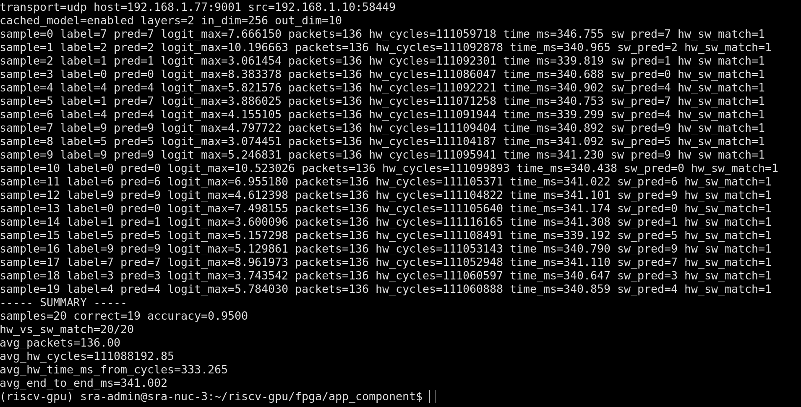
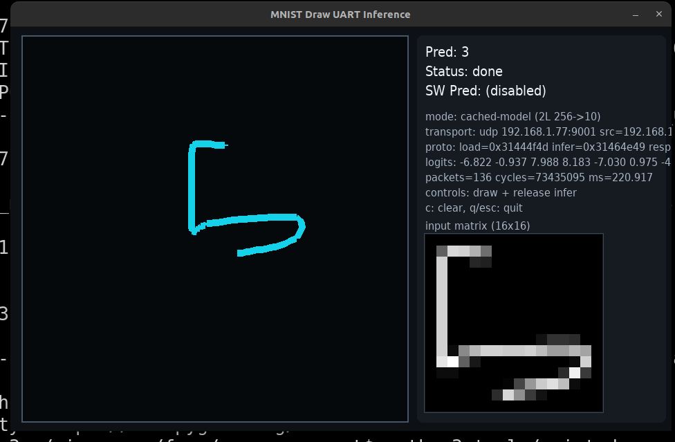
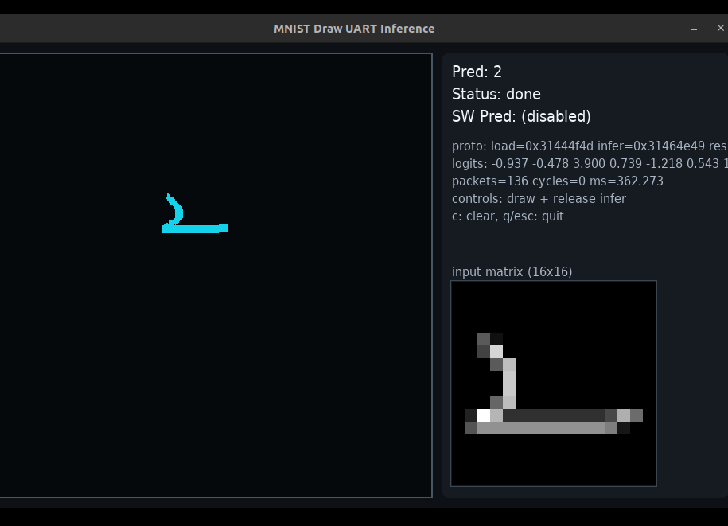
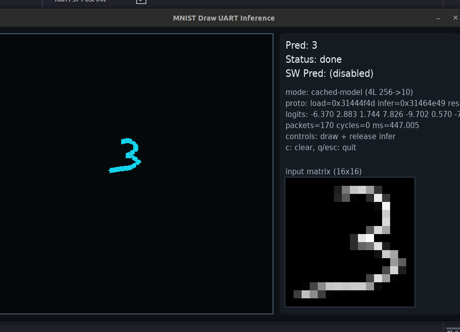
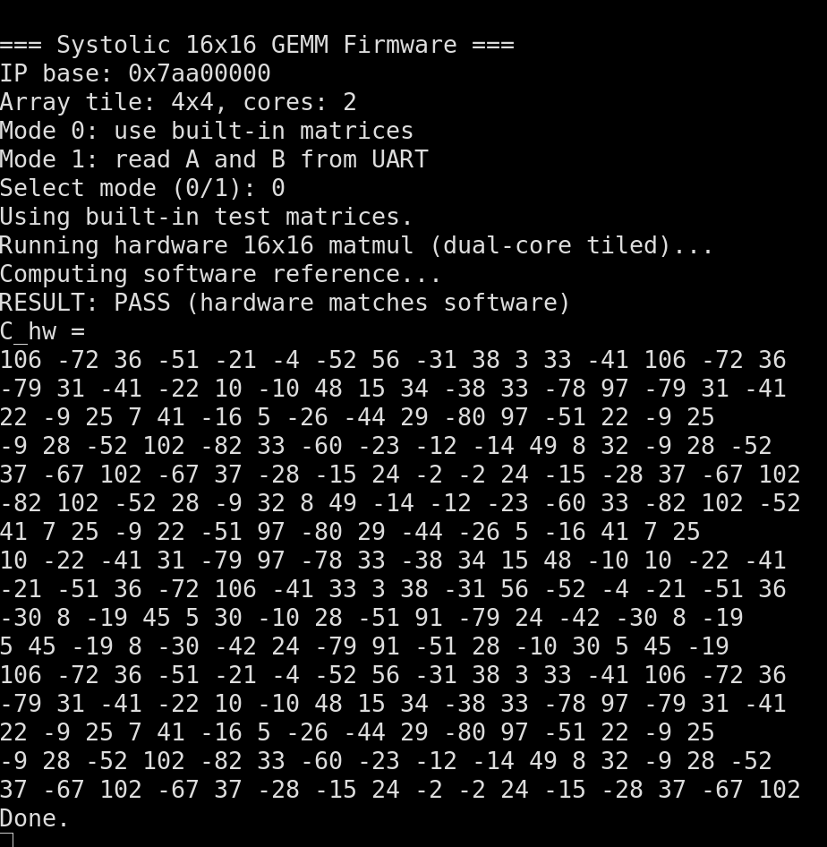

its been a while since I updated on the work I have done on top of my earlier work.

(earlier blog [here](tiny-tpu-weekend.md))

this time I wanted to test my capability of writing a multi-core system, and then writing firmware for it while optimizing it as much as possible.

thanks to [@SRA-VJTI](https://sravjti.in), I got hands on the zynq zc702 evaluation kit and it had exactly what I wanted: bigger LUTRAM and much bigger DDR3 headroom.

it also made integration way simpler for me. on arty a7-35 I was spending too much energy in interconnect + BRAM plumbing, while here I could keep the hot path in LUTRAM/scratchpad and push large buffers (especially model payloads) to DDR3.

and honestly the built-in ARM cortex side was a huge advantage. I could focus on firmware and transport logic without reinventing the full ethernet stack from scratch. ethernet on arty a7-35 would have been much harder in my opinion.

thanks to [@cupx0j0e](https://x.com/cupx0j0e) (cupjoe) for all the help and context while I was iterating through this.

## what this multi-core stack is actually doing

at a high level, the accelerator path is now a 2-core setup where each core runs a parameterized NxN systolic array tile. in the current config, each core is effectively running 4x4 tiles, and firmware composes those tiles to execute 16x16 GEMMs.

there are two key parts working together:

1. hardware control and dataflow around the cores
2. firmware scheduling + host protocol

### hardware side

the top-level controller exposes a host-programmable operand buffer interface. the host picks:

- which bank to write (A or B)
- which core to target
- row/col index
- data value

so each core has independent operand staging.

once `start` is pulsed, the control FSM walks through staged data, loads each core's local scratchpads, launches all cores together, waits until every core reports completion, and then marks the transaction done.

inside each core wrapper, compute runs in a clean sequence:

- clear accumulators
- feed wavefront data into the systolic mesh for the required cycles
- flush pipeline
- capture output into local C scratchpad

readback is also muxed by core and coordinate, so firmware can collect per-core tile results and accumulate them into global output matrices in DDR.

### firmware side

the firmware treats the accelerator as a memory-mapped engine with pulse-based control registers:

- write operands into staged banks
- pulse write
- pulse start
- poll busy/done
- pulse result read

what changed materially for performance is the tile schedule across two cores.

instead of naively reloading everything for every multiply, the schedule loads A tiles once per core for a `(tile_row, tile_k)` assignment, then sweeps all output columns by only swapping B tiles, runs, and accumulates partial sums in DDR. this cuts a lot of redundant MMIO traffic on the A side and gives much better throughput for 16x16 blocked GEMMs.

on top of raw GEMM, firmware now has a model path:

- model-load request to cache quantized layers in DDR-backed buffers
- optional chunked model upload for large payloads
- inference request that runs layer-by-layer matvec using the same tiled GEMM engine
- requant + optional relu between hidden layers
- final prediction/logits response with hardware cycle counters

so the system is not just “send A and B, get C” anymore. it is now a mini inference runtime with cached model state, transport-safe framing, and deterministic binary request/response handling.

### host/tooling side

the host scripts mirror the same binary protocol over UART or UDP. they:

- generate and pack requests
- validate hardware results against software reference
- upload cached quantized model blobs
- run inference in cached mode
- fall back to streamed tiled GEMM mode when needed

there is also a drawing/inference path that turns hand-drawn input into quantized vectors and runs end-to-end inference through the same accelerator protocol.

### the UDP part (this hurt)

the UDP firmware was such a struggle omfg.

the final transport path is robust because it does more than simple send/recv:

- static IPv4 + lwIP bring-up
- PHY forcing/profile tuning
- ARP-assisted peer discovery
- packet-level buffering so request parsing can reuse the same core logic
- fallback raw L2 frame transmit path when normal UDP TX/ARP behavior gets flaky

that fallback path plus extra counters/debug hooks made the setup much more practical on real boards and real networks.

## latency updates (uart -> ethernet)

this was one of the biggest practical wins for me.

on earlier UART-driven runs, I was hovering around ~500 ms territory for the same model class. after shifting to UDP/cached-model flow and iterating firmware+transport, I started seeing much better numbers:

- `samples=20`, `correct=19`, `accuracy=0.9500`
- `hw_vs_sw_match=20/20`
- `avg_packets=136.00`
- `avg_hw_cycles=111088192.85`
- `avg_hw_time_ms_from_cycles=333.265`
- `avg_end_to_end_ms=341.002`

in the draw-and-infer flow, I also saw examples around `220.917 ms` for a cached 2-layer path, another run around `362.273 ms`, and around `447.005 ms` for a heavier 4-layer path.

## why this feels like a step up

the old version proved I could get a systolic block working.

this version proves I can build a complete multi-core compute path around it:

- parameterized multi-core hardware scheduling
- firmware-aware data movement optimizations
- binary protocol design
- cached model runtime
- network transport integration

so this is much closer to an actual accelerator stack than just an RTL demo.

## next step

my next step forward is to keep using this parameterized NxN systolic array and max out the LUT space I have.

after that, I want to target it from a compiler flow and measure what real models I can run with this setup.

taking inspo from @PatrickToulme on X, I want to build a proper compiler target for this and run actual models end-to-end.

repo for this stage: [riscv-gpu `multi-core` branch](https://github.com/cupx0j0e/riscv-gpu/tree/multi-core)
