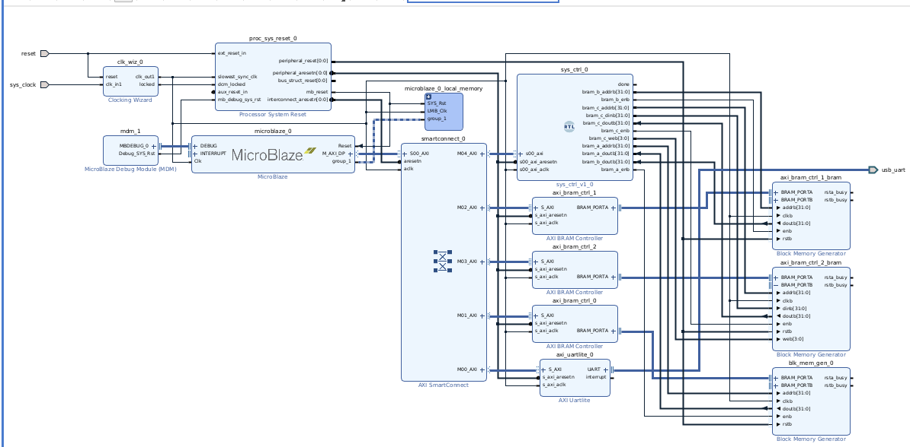
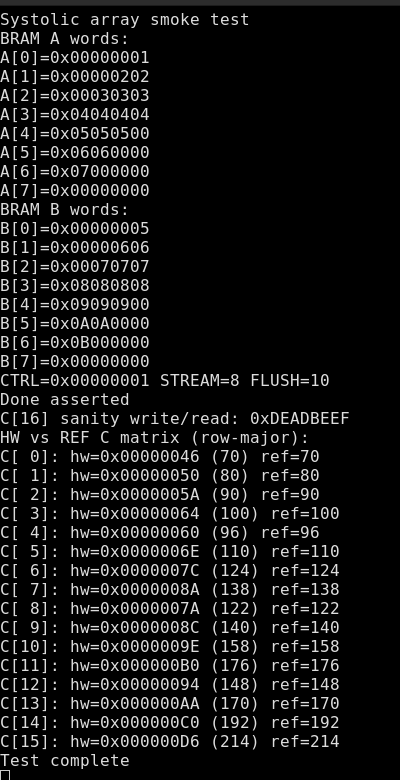
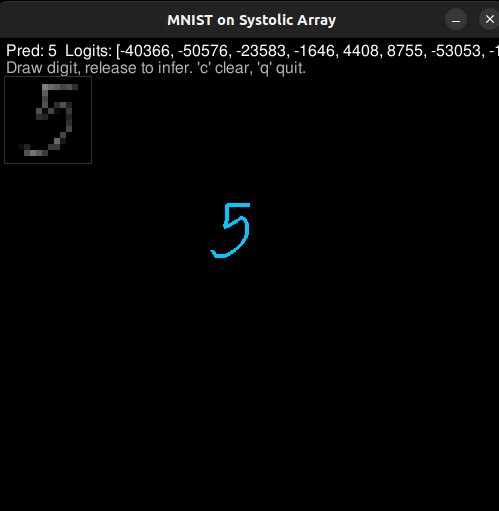
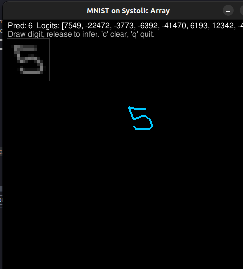
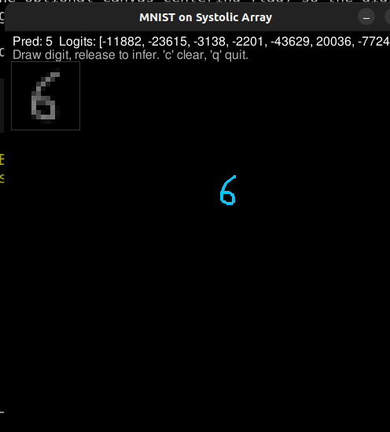
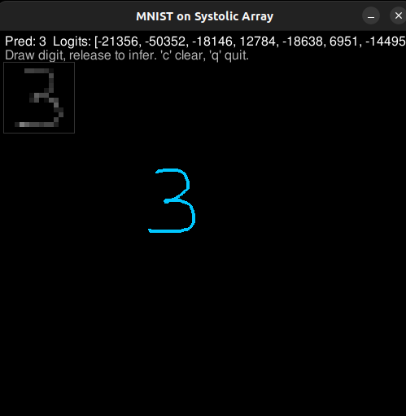

I saw [Alan Ma's tweet](https://x.com/Alan_Ma_/status/2006636128091468167) about building a tiny TPU in less than a month and kept thinking, "Is it really easier than it sounds?" So I tried to walk the same path and see if I could ship something in a week.

This is my personal experience of what worked, what broke, and what I learned.

## Starting point: a 4x4 systolic array

I started from a simple 4x4 systolic array I had built before with [@cupx0j0e](https://x.com/cupx0j0e). I fixed a few pipeline issues, cleaned up the design, and then decided to make it a real peripheral instead of a standalone block.

## Making it a real peripheral

I added AXI support, dropped it into a Vivado block design, connected it to MicroBlaze, and mapped weights/inputs/outputs as BRAM tiles.

This was my first time actually setting up Vivado, block design, and MicroBlaze end-to-end, so I spent a lot of time learning how the system actually boots and resets.

## Bring-up pain (and a lot of debugging)

I got stuck for a while because the reset logic never deasserted MicroBlaze. The proc_sys_reset blocks were not behaving like I expected, and I had to learn how Vivado's debugging tools actually work instead of just guessing.

Once I fixed that, I wrote a simple systolic array smoke test. It took more time than I expected because the AXI I wrote had timing issues with the BRAM setup.

## Feeding it from PyTorch

After the smoke test, I made helpers so the systolic array could run PyTorch GEMMs over UART. At first the firmware sent one tile at a time (painfully slow but correct). Later I switched to multi-tile batching, which finally made it feel fast and usable.

## Real models and pushing limits

To get a real model running, I took their own horizontal and vertical differentiator and ran it on my FPGA. That actually worked beautifully.

Then I tried to push it:

- Multi-tile batching in firmware.
- Using DSPs for the PEs instead of pure LUT math.

After those changes, performance felt instantly better.

Finally, I tried an MNIST classifier: a small 2-layer MLP with 8 hidden units. It worked a few times, but it was slow (around 30 seconds to print results) and fragile. The tricky part was the inference path from pygame into an MNIST-like input format. That pipeline was the first time I had built something end-to-end like this, and it showed.

## MNIST demo shots

A few screenshots and a short capture from the pygame drawing loop + inference run.

<video controls muted playsinline width="480">
  <source src="/markdown_files/posts/assets/tiny-tpu-weekend/mnist-demo.webm" type="video/webm">
  <source src="/markdown_files/posts/assets/tiny-tpu-weekend/mnist-demo.mp4" type="video/mp4">
  Your browser does not support the video tag.
</video>

## What I learned

- Turning a neat RTL block into a real peripheral is half the work.
- Vivado bring-up is its own craft: resets, clocks, and timing can kill you.
- AXI plus BRAM timing needs discipline, not just "it simmed once."
- Small firmware changes (like batching) can be bigger wins than RTL tweaks.

## Where I stopped

After the MNIST attempt, I gave up on pushing further. It still felt like a win: I got an actual model to run on hardware I built, and I learned how these systems fit together instead of just reading about them.

If I revisit this, I want to make the host-to-FPGA data path cleaner and build a more reliable input pipeline. But for a week-long experiment, it was more fun than I expected.
